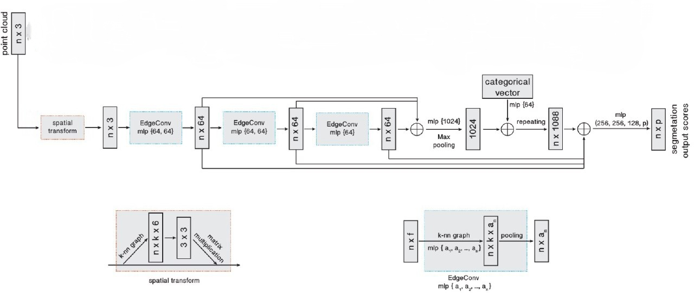

# 3D Object Detection on RGB-D Data

## Project Overview

This project tackles 3D object detection using multimodal RGB-D data consisting of 200 samples. Given the limited dataset size, I explored two distinct approaches:

1. **Training a custom architecture from scratch**, allowing full control over design and optimization.
2. **Fine-tuning a state-of-the-art pre-trained model** to benefit from transfer learning and better generalization.

**Interactive Overview**: [Pipeline Visualization](https://hamidthri.github.io/3D_Bbox_detection/assets/3d_pipeline_visualization.html)

These resources provide visual and written explanations of the architecture, data flow, and design rationale.


### Approach 1: Custom Training from Scratch

The first approach involved developing a custom multimodal architecture from the ground up. While this provided greater control over the model design and training process, it presented significant challenges given the small dataset size (200 samples), making it particularly difficult to achieve robust generalization without overfitting.

## Data Preprocessing

The dataset consists of RGB images, point clouds, 3D bounding box corners, and instance segmentation masks, stored in folders under `data/dl_challenge`. To prepare this data for training, I implemented a custom datset class that handles loading, augmentation, and transformation into a format suitable for the neural network.

### Image Preprocessing
RGB images are processed with the following steps:
- **Resizing**: Images are resized to a consistent resolution of 480×608 pixels to ensure uniformity across the dataset.
- **Training Augmentations**: For the training split, I apply the following augmentations to improve model robustness while preserving spatial relationships:
  - **Random Horizontal Flip**: 
  - **Random Rotation**: 
  - **Color Jitter**: 
  - **Random Resized Crop**: 
- **Normalization**: Images are normalized using ImageNet mean and std to match the pretrained EfficientNet-B3 backbone.
- For validation, only resizing and normalization are applied to ensure consistent evaluation.

### Point Cloud Preprocessing
Point clouds are provided as 3D arrays and processed as follows:
- **Reshaping**: The point cloud is reshaped from `(3, H, W)` to `(H*W, 3)` to represent a set of 3D points.
- **Filtering**: Invalid points (NaN values or negative z-coordinates) are removed to ensure only valid 3D points are used.
- **Sampling/Padding**: To maintain a consistent input size, point clouds are either randomly downsampled to a set value points if it is larger or padded with zeros if it is smaller.

### Bounding Box Representation Conversion
The original dataset provides 3D bounding boxes as 8-corner coordinates `(N, 8, 3)`. To simplify neural network predictions and improve training stability, I convert these to a parametric representation consisting of:
- **Center**: The 3D coordinates of the box’s center `(x, y, z)`.
- **Size**: The box’s dimensions `(width, height, depth)`.
- **Rotation Quaternion**: A 4D quaternion representing the box’s orientation.

This conversion is implemented in the `BBoxCornerToParametric` class, which uses PCA-based fitting to compute the center, size, and rotation from the corner coordinates. The resulting parameters are concatenated into a `(N, 10)` tensor per sample.

**Benefits of this conversion**:
- **Reduced Dimensionality**: Predicting 10 parameters (center, size, quaternion) instead of 24 coordinates (8 corners × 3) simplifies the regression task.
- **Regression-Friendly**: Parametric representation is more intuitive for L1 loss and avoids the need for post-processing to extract box properties.
- **Numerical Stability**: The PCA-based approach handles varying box orientations and sizes robustly, with safeguards for edge cases (e.g., degenerate boxes).

### Mask Preprocessing
Instance segmentation masks are provided as `(N, H, W)` arrays. Each mask is resized to the target image size (480×608) using nearest-neighbor interpolation to preserve binary-like values. Masks are padded or truncated to match the maximum number of objects (21) and converted to float32 tensors.

This preprocessing ensures that all inputs—RGB images, point clouds, bounding box parameters, and masks—are consistently formatted and augmented appropriately for training and validation.


## Architecture Exploration

To process the point cloud data effectively, I evaluated several state-of-the-art architectures, focusing on their computational efficiency, feature extraction quality, and suitability for a small dataset (200 samples):

- **PointNet++**: "PointNet++: Deep Hierarchical Feature Learning on Point Sets in a Metric Space" - [Original Paper](https://arxiv.org/abs/1706.02413) | [Primary Repository](https://github.com/charlesq34/pointnet2)
- **DGCNN**: "Dynamic Graph CNN for Learning on Point Clouds" - [Original Paper](https://arxiv.org/abs/1801.07829) | [Primary Repository](https://github.com/WangYueFt/dgcnn)
- **Sparse Convolutional Networks (Minkowski Engine)**: "4D Spatio-Temporal ConvNets: Minkowski Convolutional Neural Networks" - [Original Paper](https://arxiv.org/abs/1904.08755) | [Primary Repository](https://github.com/NVIDIA/MinkowskiEngine)
- **PointPillars**: "PointPillars: Fast Encoders for Object Detection from Point Clouds" - [Original Paper](https://arxiv.org/abs/1812.05784) | [Primary Repository](https://github.com/nutonomy/second.pytorch)

After some evaluation and research, **DGCNN** was selected as the optimal backbone for point cloud processing. Its dynamic graph construction, which builds k-nearest neighbor graphs (k=20) to capture local geometric relationships, provides robust feature extraction while remaining computationally efficient. This makes it particularly well-suited for our limited dataset, where overfitting is a concern.

## Final Architecture

The implemented solution, embodied in the `BBox3DPredictor` class, follows a multimodal fusion approach to combine RGB images and point clouds for 3D bounding box prediction. The architecture is designed to balance performance and efficiency, with a total parameter count well below the 100M limit.

### RGB Processing
- **Backbone**: Pre-trained EfficientNet-B3, initialized with ImageNet weights (not frozen, allowing fine-tuning for our task).
- **Feature Extraction**: Extracts 1000-dimensional features, which are projected to a 512-dimensional representation using a linear layer, ReLU activation, and dropout (0.2) for robustness.


### Point Cloud Processing

- **Architecture**: DGCNN-based feature extractor with three EdgeConv layers, each using k=20 nearest neighbors to build dynamic graphs.
- **Processing**: Takes point clouds of 8192 points (3D coordinates) and produces 256-dimensional global features through a series of graph convolutions, batch normalization, and max-pooling.
- **Output**: A compact 512-dimensional feature vector after a final linear layer, batch normalization, and dropout (0.5).

#### DGCNN Architecture

I implemented **Dynamic Graph CNN (DGCNN)** following the design outlined in the [DGCNN repo](https://github.com/AnTao97/dgcnn.pytorch). The architecture is summarized below:




### Multimodal Fusion
- **Method**: Transformer-based attention mechanism to integrate RGB and point cloud features.
- **Layers**: 4 transformer encoder layers, each with 8 attention heads and a feedforward dimension of 2048, using a feature dimension of 512.
- **Integration**: Late fusion, where RGB and point cloud features are stacked and processed by the transformer, then averaged to produce a unified 512-dimensional feature vector.

### Prediction Heads
- **Bounding Box Head**: Predicts parameters (center, size, quaternion) for up to 21 objects per scene(The maximum nymbers in the datset), outputting a tensor of shape `(batch_size, 21, 10)`.
to predict 10 value for each bounding box 3d.
- **Confidence Head**: Predicts per-object detection confidence scores, outputting a tensor of shape `(batch_size, 21)` with sigmoid activation for scores between 0 and 1.

This architecture leverages the strengths of EfficientNet-B3 for image processing, DGCNN for point cloud processing, and a transformer for robust feature fusion, ensuring accurate 3D bounding box predictions while remaining computationally efficient.


## Loss Function

### Problem Statement

3D object detection presents a challenging set prediction problem where the model must predict a variable number of objects without prior knowledge of object count or correspondence between predictions and ground truth targets. This creates inherent ambiguity in the training process that must be carefully addressed.

### Assignment Strategy

The implementation employs a direct assignment approach where predictions are matched to ground truth objects based on spatial proximity and learned feature representations. This strategy simplifies the training pipeline while allowing the model to naturally learn correspondence patterns through the optimization process.

### Loss Components

The multi-component loss function addresses four critical aspects of 3D object detection:

**1. Center Localization (Smooth L1 Loss)**
```python
center_loss = F.smooth_l1_loss(pred_centers[valid_mask], gt_centers[valid_mask])
```
Provides robust regression for 3D spatial coordinates with reduced sensitivity to outliers compared to L2 loss.

**2. Size Estimation (Log-Scale Smooth L1)**
```python
size_loss = F.smooth_l1_loss(torch.log(pred_sizes_pos), torch.log(gt_sizes_pos))
```
Operates in logarithmic space to handle the large dynamic range of object scales, ensuring proportional treatment of relative size errors across different object categories.

**3. Orientation Estimation (Angular Distance)**
```python
angle_diff = torch.acos(torch.clamp(cos_sim, 0, 1))
```
Computes geometrically meaningful angular differences between predicted and ground truth quaternions, providing proper gradients on the rotation manifold.

**4. Object Confidence (Focal Loss)**
```python
focal_weight = alpha_t * (1 - p_t) ** 2.0
```
Addresses class imbalance inherent in object detection by dynamically weighting hard negative examples and reducing the contribution of well-classified samples.

### Loss Aggregation

```python
bbox_loss = center_loss + size_loss + rotation_loss
total_loss = 5.0 * bbox_loss + conf_loss
```

The 5:1 weighting ratio between bounding box regression and confidence classification prioritizes spatial accuracy while maintaining proper confidence calibration.

### Design Rationale

- **Direct Assignment**: Reduces computational complexity while leveraging learned spatial priors for correspondence
- **Log-Scale Size Regression**: Ensures scale-invariant optimization across diverse object categories
- **Angular Rotation Loss**: Provides geometrically consistent optimization for 3D orientations
- **Focal Loss**: Mitigates class imbalance and focuses learning on challenging examples
- **Weighted Aggregation**: Balances localization precision with detection confidence

### Robustness Considerations

The loss function incorporates several stability mechanisms including value clamping for numerical stability, quaternion normalization to maintain unit constraints, and valid object masking to prevent gradient computation on empty regions. These design choices ensure stable training convergence across diverse scene configurations and varying object densities.

## Installation and Usage

### Prerequisites
```bash
pip install -r requirements.txt
```

### Data Setup
If the data is still on the google drive you can download it as follow:
```bash
gdown --id 11s-GLb6LZ0SCAVW6aikqImuuQEEbT_Fb -O dataset.tar
mkdir -p data
tar -xf dataset.tar -C data/
```
If not you can put your data in `data/dl_challenge/` directory.


```bash
ls data/dl_challenge/
```

### Training
```bash
python main.py
```

### Inference
```bash
python inference.py
```

## 📈 Visualizations and Evaluation Metrics

### 🔍 Prediction Visualizations

The model includes 3D visualization tools to qualitatively assess prediction performance. Using the `visualize_3d_predictions` function (called via `run_inference_demo` in `inference.py`), the pipeline generates side-by-side visualizations of:

- **RGB Input** (denormalized for natural color)
- **Ground Truth Boxes** (green)
- **Predicted Boxes** (red, confidence > 0.5)

These visualizations are saved under the `epoch_predictions/` folder and can be generated with:

```bash
python inference.py
```

Each output image (e.g., `prediction_demo.html`) displays the predicted and actual bounding boxes in 3D space along with the rgb image.

---

### Evaluation Metrics

Quantitative evaluation is conducted on the test set. The following metrics are reported:

| Metric                  | Value   |
|-------------------------|---------|
| **Mean Translation Error**  | 0.1307 m
| **Mean Rotation Error**     | 0.4898   
| **Mean Size Error**         | 0.4557 m 
| **Mean 3D IoU**             | 0.05  
| **Std Translation Error**   | 0.1527  
| **Std Rotation Error**      | 0.5266  
| **Std Size Error**          | 0.0394 
| **Std 3D IoU**              | 0.0485  

---

### Interpretation & Future Improvements

The evaluation results suggest:

- **Moderate performance** in predicting object centers and rotations.
- **Significant issues** with size estimation and 3D box alignment (as indicated by IoU).
- **High variability** in predictions, suggesting inconsistent model generalization.

#### 🔧 Potential Improvements:

- Incorporate **IoU-based loss** to directly optimize for spatial alignment.
- Generate **synthetic data** or apply **more aggressive augmentations** to combat overfitting.
- **Fine-tune pre-trained models** (e.g., UniDet3D) to improve generalization on small datasets.
- **Verify evaluation logic**, particularly the 3D IoU computation and thresholding conditions.

These visualizations and metrics provide an in-depth understanding of the model's strengths and highlight key areas for future development.


## Key Challenges and Solutions

1. **Limited Dataset Size**: With only 200 samples, preventing overfitting was paramount. Solutions included aggressive dropout, careful augmentation, and pre-trained feature extractors.

2. **Multimodal Registration**: Ensuring RGB and point cloud features remain aligned after preprocessing required careful coordinate system management.

3. **Parametric Conversion Stability**: Developing robust algorithms for corner-to-parametric conversion that handle degenerate cases and maintain differentiability.

4. **Memory Constraints**: Efficiently processing high-resolution RGB images alongside dense point clouds within GPU memory limits.

The small dataset size ultimately made training from scratch particularly challenging, reinforcing the value of transfer learning approaches for limited-data scenarios in 3D computer vision tasks.

## Approach 2: Pre-trained Model Fine-tuning

As an alternative to training a custom model from scratch, I explored fine-tuning the state-of-the-art UniDet3D framework ([https://github.com/filapro/unidet3d](https://github.com/filapro/unidet3d)), which leverages the Superpoint Transformer ([https://github.com/drprojects/superpoint_transformer](https://github.com/drprojects/superpoint_transformer)) for preprocessing. This approach promised faster convergence and better generalization due to pre-trained weights, which are particularly beneficial for small datasets like ours (200 samples). However, it required significant preprocessing overhead and dependency management, as the Superpoint Transformer involves complex data transformations to align RGB and point cloud data.

I successfully set up the UniDet3D framework, including configuring the preprocessing pipeline and integrating it with my dataset structure. However, due to time constraints, I was unable to fully fine-tune the model on my specific dataset. The setup included adapting the data loading to handle our RGB images, point clouds, and bounding box annotations, but further optimization (e.g., hyperparameter tuning, adjusting learning rates) was not completed. This approach remains promising for future work, as the pre-trained weights could potentially outperform the custom model with proper fine-tuning.
